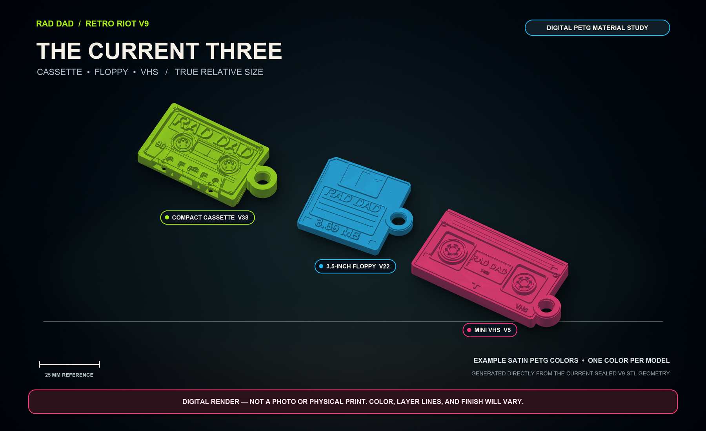

# Rad Dad Merch

Canonical home for Rad Dad physical merchandise. History imported from `rupret007/Rad-Dad-QR-Merch` at `b001fdd`. That repo stays as backup.


<p align="center"><strong>REAL DETAILS. LOUD BAND. ONE SCAN.</strong></p>

Rad Dad QR Merch turns familiar music and computer hardware into durable,
one-color punk-rock keepsakes. The collection includes an authentic micro
compact cassette, 3.5-inch floppy disk, mini VHS cassette, and the deliberately
ridiculous Trailer Swift desk collectible.

**V9 is the recommended production release.** It keeps the successful size,
keyring, and QR-fit decisions from earlier releases while restoring or deepening
the physical details that make each object immediately recognizable.

The models remain one-color prints. The interaction layer is a separate
1-inch QR sticker that opens:

```text
https://raddadband.com/qr/
```

> [!IMPORTANT]
> V9 does not enlarge the products. External envelopes, integrated keyring
> dimensions, 6 mm media-keychain bores, and the 26-27 mm protected QR landings
> stay unchanged. Authenticity improvements are contained within those proven
> boundaries.

## Start here

| I want to... | Use this |
|---|---|
| Download the complete release | [`release/v9/Rad_Dad_Retro_Riot_v9_Authenticity_QR_Print_Pack.zip`](release/v9/Rad_Dad_Retro_Riot_v9_Authenticity_QR_Print_Pack.zip) |
| Preview the current cassette, floppy, and VHS together | [Current Three digital PETG material study](docs/previews/Rad_Dad_Current_Three_PETG_Material_Study.png) |
| Browse or hold those digital studies | `python3 tools/serve_digital_merch.py` then open `/catalog` |
| Check a cart change after a connection problem | Use **Review current hold cart**; see [cart updates and recovery](docs/DIGITAL_CART.md) |
| Reopen or withdraw a digital hold | Open **Your holds** at `/holds` in the same browser session; see [digital holds](docs/DIGITAL_HOLDS.md) |
| Print the current cassette, floppy, and VHS together | [`release/v9/3mf/Rad_Dad_Retro_Riot_v9_CURRENT_THREE_CASSETTE_FLOPPY_VHS_A1_MINI_0.4_PROJECT.3mf`](release/v9/3mf/Rad_Dad_Retro_Riot_v9_CURRENT_THREE_CASSETTE_FLOPPY_VHS_A1_MINI_0.4_PROJECT.3mf) |
| Print the four models | [`release/v9/3mf/`](release/v9/3mf) or [`release/v9/stl/`](release/v9/stl) |
| Send one sticker to a professional vendor | `release/v9/guides/qr_stickers/Rad_Dad_QR_1IN_VENDOR_MASTER.svg` or its PDF master |
| Print precut Avery 6450 / OL1025 labels | `release/v9/guides/qr_stickers/Rad_Dad_QR_AVERY_6450_OL1025_63UP_US_LETTER.pdf` |
| Print a full adhesive sheet at FedEx Office | `release/v9/guides/qr_stickers/Rad_Dad_QR_FEDEX_OFFICE_FULL_SHEET_48UP_US_LETTER.pdf` |
| Print when black ink is unavailable | Official `Rad_Dad_QR_RED_*` fallback files in `release/v9/guides/qr_stickers/` |
| Understand sticker production | [QR sticker guide](docs/QR_STICKERS.md) |
| Review the retired NFC workflow | [NFC legacy notice](docs/NFC.md) |

The v9 ZIP is the canonical handoff. The paths above are the generated v9
release layout already present in this repository.

### Current Three material study

[](docs/previews/Rad_Dad_Current_Three_PETG_Material_Study.png)

This preview is generated directly from the three current sealed v9 STL files
with one shared orthographic camera, so their relative sizes remain honest.
The lime, blue, and pink surfaces are example one-color satin PETG treatments;
the image is not a photo, slicer preview, printability result, or substitute for
the physical acceptance checklist. Its source hashes, measured envelopes,
renderer identity, digital-only status, and output hash are recorded in the
[provenance file](docs/previews/Rad_Dad_Current_Three_PETG_Material_Study.json).
Regenerate or verify it with:

```bash
python3 tools/render_current_three_material_study.py
python3 tools/render_current_three_material_study.py --check
python3 tools/serve_digital_merch.py
python3 tools/verify_digital_merch.py
```

The digital merch desk turns that leftover study into a shopper catalog, cart,
and admin publish/hold path. Catalog cards crop the shared render so cassette,
floppy, and mini VHS are identifiable on a phone. Checkout cannot run until the
shopper confirms a digital hold, then it opens a session-owned receipt. It
accepts digital study requests only. It does not take payment, ship an object,
start a Bambu job, change the QR destination, or post merch. The public merch
path serves the study image and catalog copy; it does not serve STL, 3MF,
renderer, or release files. Admin stays locked until
`RAD_DAD_MERCH_ADMIN_TOKEN` is set.

**Your holds** lists this browser session's receipts, newest first. A shopper can
reopen a receipt and explicitly confirm withdrawal; the admin sees the same
withdrawn status. The original receipt stays readable. Holds live only in the
running server's memory: a server restart clears them, and clearing or losing
the session cookie removes access. See [digital holds](docs/DIGITAL_HOLDS.md)
for the flow and verification.

Cart updates show a visible result and pause further edits while pending. If a
response is lost, the browser never resends the change automatically: use
**Review current hold cart** to load the server's current quantities before
editing or requesting a hold. See [cart updates and recovery](docs/DIGITAL_CART.md).
Digital verification uses Python 3.9+ and Node.js 18+; the JavaScript checks
use Node's standard library and require no npm packages.

## What changed in v9

### Cassette v38

Cassette v38 uses the watertight, audited v36 cassette body that produced the
successful physical reference print. Its **actual narrow tape-entry edge** is
preserved directly, including the stepped shell and asymmetric transport
apertures where a real cassette deck's head, capstan, guides, and pinch roller
engage the tape. These are not reconstructed face markings or generic slots.

Only the side-eyelet zone is moved inward to retain the later compact envelope.
The deformation is zero at the tape-entry edge, so the inherited transport
geometry remains unchanged. The proven 6 mm bore and rear QR landing are part
of the same audited body.

The shell still carries unequal tape packs, six-lobe drive hubs, center tape
window, pressure-pad cue, shell hardware, readable `RAD DAD`, `90`, and the
small `C-69` easter egg. The existing rear QR landing and compact keyring eyelet
remain unchanged.

### Floppy v22

Floppy v22 retains the developed rear hub, shutter-track, shell-seam,
write-protect, and density cues that make the underside read as a real 3.5-inch
floppy instead of a flat backing plate. The front keeps its shutter, label
hierarchy, and `RAD DAD`, while the `3.69 MB` joke is enlarged to
20.00 x 4.00 mm with heavier strokes for reliable one-color printing.

The improved marking and rear treatment stay inside the same protected 1-inch
QR landing, outside size, 4.130 mm thickness, and keyring geometry.

### VHS v5

VHS v5 strengthens the device-specific reel, tape-path, door, latch, insertion,
shell, and rear-housing cues so it reads as a VHS cassette from the front, side,
and back rather than as a stretched compact cassette.

The established rear QR landing, product envelope, and keyring geometry stay
unchanged. The restrained `T-369` detail remains part of the collection-wide
capacity joke.

### Trailer Swift v16

Trailer Swift v16 keeps the spiky punk hair, guitar, compact toy proportions,
solid display base, and readable `TRAILER SWIFT` nameplate while changing the
character's expression from angry or scary to friendly, funny, and knowingly
ridiculous. A slimmer, slightly cocked head, relaxed brows, molded eyelids and
smile creases, a broad singing grin, finished boots, and readable Strat
hardware make it a quirky collectible joke rather than a horror figure.

The 45 mm circular base and protected 27 mm QR landing beneath it stay
unchanged.

## Product specification

| Product | Revision | Unchanged external envelope | Keyring / format | V9 authenticity focus |
|---|---|---:|---|---|
| Rad Dad Compact Cassette | v38 | 58.162 x 30.260 x 6.685 mm | Integrated 6 mm bore | Exact audited narrow tape-entry edge and complete cassette transport geometry |
| Rad Dad 3.5-Inch Floppy | v22 | 44.360 x 36.916 x 4.130 mm | Integrated 6 mm bore | Authentic rear mechanics and enlarged, bold `3.69 MB` capacity mark |
| Rad Dad Mini VHS | v5 | 65.800 x 31.900 x 7.000 mm | Integrated 6 mm bore | Stronger VHS reel, tape-door, latch, insertion, and rear-device language |
| Trailer Swift | v16 | 45.000 x 45.000 x 64.400 mm | Upright desk collectible | Friendly punk caricature on a solid QR-ready display base |

| Product | Protected QR landing | Finished sticker | Radial placement clearance |
|---|---:|---:|---:|
| Cassette | 26.0 mm | 25.4 mm | 0.3 mm |
| Floppy | 26.0 mm | 25.4 mm | 0.3 mm |
| VHS | 26.0 mm | 25.4 mm | 0.3 mm |
| Trailer Swift | 27.0 mm | 25.4 mm | 0.8 mm |

## Authenticity standard

Every v9 design follows the same product rule: authentic first, branded second.

- The silhouette must identify the original object before the viewer reads the
  Rad Dad branding.
- Front, lower edge, side, and rear details must agree with the same device.
- Small features may be exaggerated enough to survive a 0.4 mm nozzle, but they
  must still represent real hardware.
- Branding may occupy label areas, but it must not replace the reels, shutters,
  transport openings, tape doors, shell seams, or other defining mechanics.
- The QR landing belongs on the rear or underside and must not flatten the
  product's authentic front.
- Durability, pocket carry, keyring access, and clean one-color printing take
  priority over fragile cosmetic detail.

## QR system

V9 removes decorative styling from the QR artwork. Preferred production uses
only pure black and pure white. The same pack includes an official pure
process-red (`#FF0000`) on white fallback, generated by the existing
`qr_artwork_v9` path, for color cartridges when black ink is unavailable:

| Property | V9 production specification |
|---|---|
| Destination | `https://raddadband.com/qr/` |
| Finished label | 25.4 mm / 1 inch round |
| QR matrix | 29 x 29 modules |
| Error correction | Q |
| Quiet zone | Four white modules on every side |
| Printed QR square | 16.5 mm; never scale smaller |
| Module pitch | Approximately 0.446 mm |
| Preferred ink | Solid black only, no gray screening |
| Official fallback ink | Pure process red `#FF0000` on white; print as color, never grayscale |
| Stock | Matte white adhesive stock |
| Individual master | Vendor-ready vector plus 600 DPI raster/PDF |
| Precut sheet | US Letter, 63-up Avery 6450 / OnlineLabels OL1025 |
| Copy-center sheet | US Letter full-sheet layout for FedEx Office cutting |
| Fallback files | `Rad_Dad_QR_RED_1IN_VENDOR_MASTER`, `Rad_Dad_QR_RED_AVERY_6450_OL1025_63UP_US_LETTER`, `Rad_Dad_QR_RED_FEDEX_OFFICE_FULL_SHEET_48UP_US_LETTER`, and `Rad_Dad_QR_RED_PRINT_CALIBRATION_US_LETTER` |

No logo, lightning bolt, text, texture, decorative color, rounded module,
transparent area, or artwork may enter the QR square or its white quiet zone.
Any surrounding label text must use the same ink as the modules. Approve the
red fallback only after the red calibration page scans from two phones.

## Printing stickers at home

1. Use matte white adhesive label stock compatible with the printer.
2. Open the PDF, not a screenshot or browser preview.
3. Select **Actual Size**, **100%**, or **No Scaling**.
4. Disable `Fit`, `Shrink oversized pages`, borderless enlargement, and photo
   optimization.
5. Print preferred black masters at the highest black-text or monochrome
   quality available. If using the official `Rad_Dad_QR_RED_` fallback, print
   as color rather than grayscale.
6. Measure a finished circle. It must be 25.4 mm across.
7. Scan samples before cutting and again after application.

Clear tape over an ordinary-paper prototype is acceptable for a fit test, but
it is not the production finish. Tape glare, bubbles, lifted edges, and adhesive
creep can reduce scan reliability. Matte white adhesive stock is the supported
batch-production material.

## FedEx Office handoff

Use the dedicated full-sheet FedEx Office PDF. Ask for:

- US Letter output.
- Actual Size / 100% with no fit-to-page scaling.
- Crisp black-only printing on matte white adhesive stock, or the official
  `Rad_Dad_QR_RED_` fallback printed as color if black ink is unavailable.
- One proof sheet before the full quantity.
- No lamination or gloss coating over the QR.

If the location cannot supply compatible matte adhesive stock, bring laser-safe
full-sheet matte white label paper and confirm that the store accepts customer
stock before ordering. Measure and scan the proof while still at the counter.

## Mandatory physical scan QC

Digital generation does not prove that a printed sticker scans. Every batch
must pass physical quality control:

1. Print the calibration page at Actual Size / 100%.
2. Confirm the 25.4 mm circle and any dimensional reference with a ruler or
   caliper.
3. Check that modules are square, solid, separated, and surrounded by an intact
   white quiet zone.
4. Scan labels from the top, center, and bottom of every printed sheet.
5. Verify that every sample opens exactly `https://raddadband.com/qr/`.
6. Apply stickers only to clean, dry, flat landings.
7. Scan every finished product with at least one current iPhone and Android
   phone.
8. Repeat scans under ordinary indoor lighting and from more than one approach
   angle.
9. Allow the adhesive to cure for 24 hours, perform carry and handling checks,
   and scan again.
10. Do not distribute any piece that scans slowly, inconsistently, or to the
    wrong destination.

## Model printing baseline

| Setting | Media keychains | Trailer Swift |
|---|---|---|
| Printer | Bambu Lab A1 Mini | Bambu Lab A1 Mini |
| Nozzle | 0.4 mm | 0.4 mm |
| Layer height | 0.16 mm | 0.16 mm |
| Initial layer | 0.20 mm | 0.20 mm |
| Walls | 4 | 4 |
| Top / bottom layers | 5 / 5 | 5 / 5 |
| Infill | 30% gyroid | 30% gyroid |
| Wall generator | Arachne | Arachne |
| Supports | Off | Organic/tree, build plate only |
| Orientation | Detailed face upward | Upright on circular base |

Use an explicitly named `_A1_MINI_0.4_PROJECT.3mf` for embedded Bambu settings.
Use a `_MODEL_ONLY.3mf` or binary STL when choosing a custom profile. Inspect
the sliced preview before committing material.

## Release lineage

| Release | Status | Purpose |
|---|---|---|
| [`release/v9`](release/v9) | **Recommended** | Authenticity-restored models and production black-and-white QR system |
| [`release/v8`](release/v8) | Superseded | First QR-first release; reused v7 geometry unchanged |
| [`release/v7`](release/v7) | Legacy archive | Final NFC-oriented micro-replica release |

NFC remains documented for historical reference, but it is not part of the v9
production workflow. Existing v7 and v8 prints can still use the v9 25.4 mm QR
sticker because the landing dimensions did not change.

## Repository map

| Path | Purpose |
|---|---|
| `release/v9/` | Recommended Authenticity + QR release |
| `release/v8/` | Historical first QR release |
| `release/v7/` | Historical NFC release |
| `src/digital_merch/` | Digital merch desk: catalog, cart, admin, public-path security |
| `docs/QR_STICKERS.md` | QR artwork, printing, installation, and physical QC |
| `docs/NFC.md` | Legacy NFC retirement notice |
| `CHANGELOG.md` | Release history and revision details |

## Safety and scope

These are promotional keepsakes, not safety equipment. Eyelets are not rated
for climbing, restraint, lifting, or protecting valuables. Small parts and
split rings may present hazards to children. Follow printer, filament, adhesive,
cutting-tool, and copy-center safety guidance.

See [LICENSE.md](LICENSE.md) and [THIRD_PARTY_NOTICES.md](THIRD_PARTY_NOTICES.md)
for licensing and attribution details.
