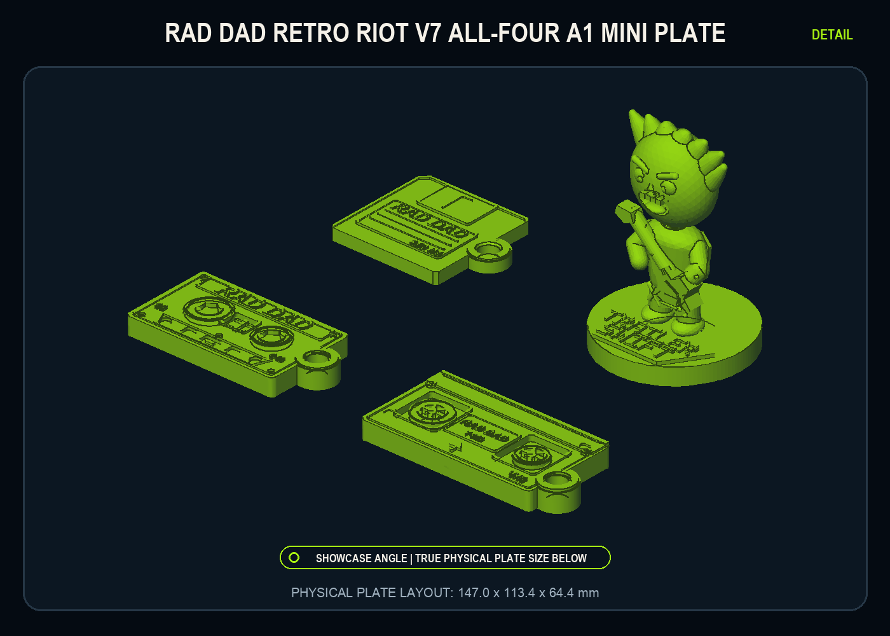
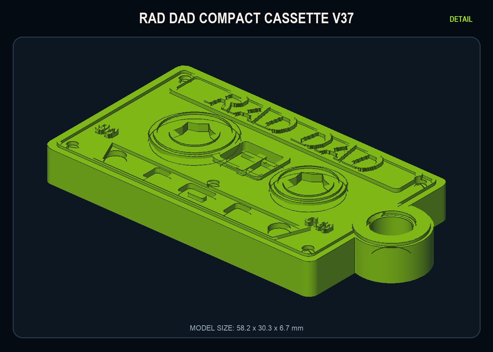
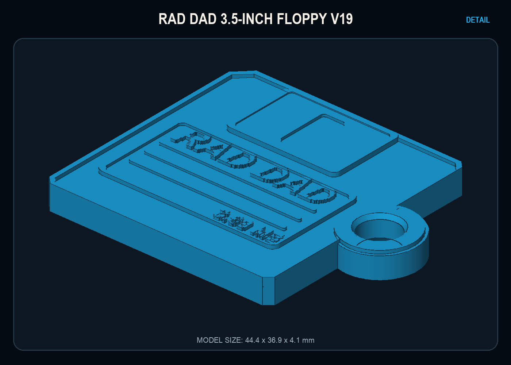
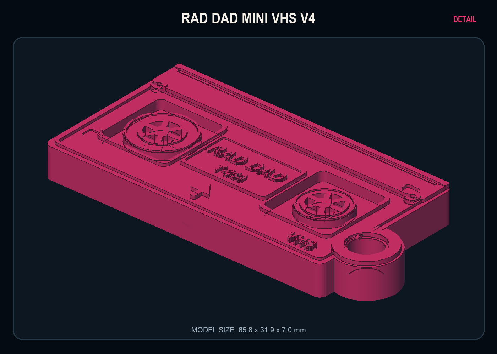
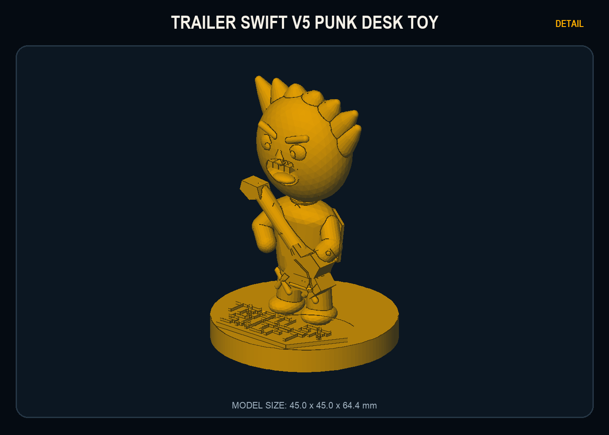

# Rad Dad Retro Riot v7: Micro Replica Edition

<p align="center"><strong>OLD MEDIA. LOUD BAND. ONE TAP.</strong></p>

Rad Dad Retro Riot turns the hardware we grew up rewinding, labeling, and
carrying into punk-rock NFC keepsakes. V7 contains three one-color media
keychains and one deliberately ridiculous desk collectible: an authentic micro
cassette, a 3.5-inch floppy, a VHS cassette, and Trailer Swift with a flaming
guitar and an NFC base.

These are not generic rectangles with logos attached. Each model is built
around the mechanical details that make the original object recognizable, then
slightly exaggerates those details so they survive at micro-replica scale.



> [!IMPORTANT]
> V7 is a digitally validated release candidate, not a physically qualified
> production batch. The released meshes pass recorded digital geometry checks.
> Ring fit, drop resistance, pocket carry, NFC reliability, adhesive life, and
> Trailer Swift stability still require documented proof-print results before
> batch production.

## Start here

| I want to... | Use this |
| --- | --- |
| Download everything | [Complete v7 print pack ZIP](release/v7/Rad_Dad_Retro_Riot_v7_Micro_Replica_Print_Pack.zip) |
| Print all four on an A1 Mini | [All-four A1 Mini Bambu project](release/v7/3mf/Rad_Dad_Retro_Riot_v7_ALL_FOUR_A1_MINI_0.4_PROJECT.3mf) |
| Print one item with embedded Bambu settings | Choose its `_A1_MINI_0.4_PROJECT.3mf` file below |
| Use another slicer or choose my own profile | Choose the STL or `_MODEL_ONLY.3mf` file below |
| Print the NFC sticker artwork | [Mixed 20-up overlay sheet](release/v7/guides/nfc_overlays/Rad_Dad_25MM_MIXED_TAP_LABEL_SHEET_20UP_US_LETTER.pdf) |
| Install and program the tags | [NFC setup guide](release/v7/guides/NFC_SETUP.md) and [placement diagram](release/v7/guides/Rad_Dad_NFC_Placement_Guide.svg) |
| Check the archive | [SHA-256 checksum](release/v7/Rad_Dad_Retro_Riot_v7_Micro_Replica_Print_Pack.zip.sha256) and [manifest](release/v7/MANIFEST.json) |

If GitHub opens a binary file instead of downloading it, use the download
button on that file's GitHub page. Start with one individual proof print before
using the all-four plate.

## The lineup

The dimensions below are measured from the individual STL files in the current
v7 release. Keychain envelopes include their eyelets.

| Product | Revision | Released STL envelope | Format | Defining features |
| --- | --- | --- | --- | --- |
| Rad Dad Compact Cassette | v37 | 58.162 x 30.260 x 6.685 mm | Keychain | Unequal tape packs, six-lobe drive hubs, center tape window, five blind transport recesses, pressure pad, five shell screws, large raised `RAD DAD`, and hidden `C-69` |
| Rad Dad 3.5-Inch Floppy | v19 | 44.360 x 36.916 x 4.130 mm | Keychain | Top shutter, writable label, write-protect and density details, rear hardware treatment, raised `RAD DAD`, and visible `3.69 MB` |
| Rad Dad Mini VHS | v4 | 65.800 x 31.900 x 7.000 mm | Keychain | Two independent reel windows, tape-coil arcs, six-rib hubs, center label, full-width dust cover, latch, insertion arrow, `VHS`, and `T-369` |
| Trailer Swift | v5 | 45.000 x 45.000 x 64.400 mm | NFC desk collectible | Oversized angry head, flame hair, solid faux spring neck, punk body, integrated angular punk electric guitar, broad shoes, nameplate, circular base, and underside NFC landing |

| Cassette | Floppy |
| --- | --- |
|  |  |

| VHS | Trailer Swift |
| --- | --- |
|  |  |

These are generated software previews. They document the released geometry but
are not photographs or evidence of physical-print approval.

## Why the media pieces feel authentic

### Compact cassette v37

The cassette preserves the visual hierarchy of a real compact cassette rather
than replacing it with branding. One tape pack is visibly fuller than the
other. Broad six-lobe drive profiles sit inside stepped reels. A separate
center window suggests the tape and leader. The lower edge contains five deep
blind transport recesses and a pressure-pad detail without opening unsupported
holes through the NFC back. Five screw positions, shell seams, label rules,
`90`, and `C-69` finish the illusion. `RAD DAD` remains large enough to read at
keychain scale.

### 3.5-inch floppy v19

The familiar label-facing side keeps the shutter above the writable label. The
shell includes the clipped corner, write-protect and density controls, shutter
track, insertion cues, and a rear landing designed to work with the NFC
overlay. The tag is larger than a correctly scaled floppy hub, so the printed
overlay completes the faux metal-hub illusion without introducing metal near
the antenna.

### Mini VHS v4

The VHS does not reuse the compact cassette layout. It has two separate reel
windows, compact six-rib hubs, visible tape-coil arcs, a central paper-label
zone, a dominant hinged dust-cover band, hinge and latch cues, and directional
asymmetry. Those features are what make it read as VHS before the small `VHS`
mark is noticed.

### Trailer Swift v5

Trailer Swift is intentionally not another flat keychain. It is a one-piece,
three-dimensional punk desk figure with toy proportions, a solid structural
neck disguised by bobblehead-style rings, and a guitar fused at multiple
points. The round base carries the `TRAILER SWIFT` identity on the front and
the NFC interaction underneath. Trailer Swift has no keyring eyelet.

## The 369 Easter egg

The media line carries a deliberately fictional capacity and runtime thread:

| Product | Marking | Placement |
| --- | --- | --- |
| Cassette | `C-69` | Small lower-right cassette marking |
| Floppy | `3.69 MB` | Front writable label |
| VHS | `T-369` | Small video-grade marking |
| Trailer Swift | None | The joke stays with the media formats |

The markings are small by design, but they must remain printable and readable
at normal handheld distance. They are Easter eggs, not substitutes for the
hardware details.

## Download one product

| Product | Bambu Studio project | Model-only 3MF | STL |
| --- | --- | --- | --- |
| Cassette v37 | [A1 Mini project](release/v7/3mf/Rad_Dad_Cassette_v37_A1_MINI_0.4_PROJECT.3mf) | [Model-only 3MF](release/v7/3mf/Rad_Dad_Cassette_v37_MODEL_ONLY.3mf) | [Binary STL](release/v7/stl/Rad_Dad_Cassette_v37_BINARY.stl) |
| Floppy v19 | [A1 Mini project](release/v7/3mf/Rad_Dad_Floppy_v19_A1_MINI_0.4_PROJECT.3mf) | [Model-only 3MF](release/v7/3mf/Rad_Dad_Floppy_v19_MODEL_ONLY.3mf) | [Binary STL](release/v7/stl/Rad_Dad_Floppy_v19_BINARY.stl) |
| Mini VHS v4 | [A1 Mini project](release/v7/3mf/Rad_Dad_Mini_VHS_v4_A1_MINI_0.4_PROJECT.3mf) | [Model-only 3MF](release/v7/3mf/Rad_Dad_Mini_VHS_v4_MODEL_ONLY.3mf) | [Binary STL](release/v7/stl/Rad_Dad_Mini_VHS_v4_BINARY.stl) |
| Trailer Swift v5 | [A1 Mini project](release/v7/3mf/Trailer_Swift_v5_Bobblehead_NFC_A1_MINI_0.4_PROJECT.3mf) | [Model-only 3MF](release/v7/3mf/Trailer_Swift_v5_Bobblehead_NFC_MODEL_ONLY.3mf) | [Binary STL](release/v7/stl/Trailer_Swift_v5_Bobblehead_NFC_BINARY.stl) |

## Print-ready project or model-only file?

The `.3mf` extension alone does not tell you whether print settings are
included.

| File type | What it contains | Best use |
| --- | --- | --- |
| `_A1_MINI_0.4_PROJECT.3mf` | Geometry plus the intended A1 Mini, 0.4 mm nozzle, process, placement, and support configuration | Fastest start for Bambu Studio users |
| `_MODEL_ONLY.3mf` | Deterministic geometry package without a printer, filament, process, or support profile | Makers who want to choose every setting or use compatible software |
| `_BINARY.stl` | Universal mesh geometry only | Other slicers, inspection, repair, or custom plate layouts |

"Print-ready" means the intended slicer configuration is embedded. It does not
mean the design has passed the pending physical qualification. Always open the
project, confirm the selected printer, nozzle, filament, and actual build plate,
then inspect every sliced layer before printing.

## A1 Mini and 0.4 mm starting profile

The current v7 operating profile is intentionally one color. Relief, recesses,
stepped surfaces, and shadows create the contrast.

| Setting | Cassette, floppy, and VHS | Trailer Swift |
| --- | --- | --- |
| Printer | Bambu Lab A1 Mini | Bambu Lab A1 Mini |
| Nozzle | 0.4 mm | 0.4 mm |
| Build plate | Textured PEI | Textured PEI |
| Embedded filament baseline | Bambu PLA Basic | Bambu PLA Basic |
| Layer height | 0.16 mm | 0.16 mm |
| Initial layer | 0.20 mm | 0.20 mm |
| Walls | 4 | 4 |
| Top layers | 5 | 5 |
| Bottom layers | 5 | 5 |
| Infill | 30% gyroid | 30% gyroid |
| Wall generator | Arachne | Arachne |
| Top pattern | Monotonic | Monotonic |
| Supports | Off | Organic or tree, build plate only |
| Orientation | Detailed face upward | Upright on circular base |

The final embedded quality profile uses 30 mm/s outer walls, 30 mm/s top
surfaces, 25 mm/s small perimeters, and rear seam placement. It retains 0.16 mm
layers, a 0.20 mm initial layer, Arachne walls, four walls, five top and bottom
layers, 30% gyroid infill, and Textured PEI. A 5 mm brim is recommended for the
first Trailer Swift proof.

Bambu PLA Basic is the embedded filament baseline. PLA Tough or PLA+ may be
used for a durability-focused proof only with a matching, calibrated filament
profile; do not print those materials under the Bambu PLA Basic profile merely
because the geometry is unchanged.

The physical plate selected in Bambu Studio must match the plate installed on
the printer. Do not rely on a remembered or previously active plate setting.

## Printing all four together

Use the [all-four A1 Mini project](release/v7/3mf/Rad_Dad_Retro_Riot_v7_ALL_FOUR_A1_MINI_0.4_PROJECT.3mf)
only after each individual design has produced a successful proof.

The deterministic model-only all-four layout contains exactly four objects on
a 180 x 180 mm plate. It requires at least 10 mm spacing and records a minimum
actual bounding-box gap of 23.019 mm. The current Bambu Studio project is
separately auto-arranged and records an approximately 21.84 mm minimum gap.
Both exceed the 10 mm requirement. Cassette, floppy, and VHS are face-up.
Trailer Swift is base-down.

The combined Bambu project uses global `tree(auto)`, build-plate-only support
because the Bambu command-line postprocessor cannot reliably serialize a
Trailer-only support override. Before printing, inspect Preview and confirm
that no unnecessary support is generated beneath the three flat media pieces.
Print by layer, not sequentially by object.

For a custom slicer configuration, use the [all-four model-only plate](release/v7/3mf/Rad_Dad_Retro_Riot_v7_ALL_FOUR_MODEL_ONLY.3mf).

## Keyrings

Cassette, floppy, and VHS use the same nominal keyring interface:

| Feature | Specification |
| --- | --- |
| Clear bore | 6.0 mm |
| Outer eyelet diameter | 12.0 mm nominal |
| Face lead-ins | 7.0 mm diameter on both faces |
| Intended test | Thickest production split ring installed by hand in under 30 seconds |
| Static-load acceptance | 2 kg suspended for 60 seconds |
| Pull-and-twist acceptance | 25 complete cycles |
| Drop acceptance | Six 1 m drops, one in each planned orientation |
| Carry acceptance | 72 hours attached to an ordinary production key set |

The geometry is digitally present, but the fit and durability targets remain
physically unverified. Do not force an oversized ring into a proof print and do
not treat the eyelet as load-bearing safety hardware. Trailer Swift is a desk
collectible and has no keyring.

## NFC hardware and programming

Use genuine, nonmetal, peel-and-stick 25 mm NFC Forum Type 2 tags. NTAG213 is
the preferred starting point for the short redirect used by this project.
Record the tag manufacturer, SKU, lot, measured diameter, and thickness for
every production batch.

Program this NDEF HTTPS URI for all four products:

```text
https://raddadband.com/tap/
```

Do not permanently lock a tag until the written URL has been confirmed and the
loose tag has passed scanning tests.

## Installing the 25 mm tag and overlay

The printed overlay goes on top of the programmed NFC tag. It does not replace
the NFC tag.

1. Program the tag with one NDEF URI record for `https://raddadband.com/tap/`.
2. Scan the loose tag ten consecutive times on an iPhone and ten on Android.
3. Clean the printed landing with isopropyl alcohol and let it dry completely.
4. Center the 25 mm tag on the marked rear landing or beneath Trailer Swift's base.
5. Press the tag firmly for 20-30 seconds.
6. Repeat both ten-scan phone tests after installation.
7. Apply the matching nonmetal printed overlay directly over the tag.
8. Apply a clear nonmetal PET or polypropylene overlaminate over the printed overlay.
9. Test the completed tag, overlay, and overlaminate stack ten consecutive times on both iPhone and Android with a normal phone case, production split ring, and ordinary key bundle in place.
10. Allow the complete adhesive stack to cure for 24 hours, then repeat the completed-stack iPhone and Android tests with the case, ring, and key bundle.

| Product | Tag location | Matching overlay |
| --- | --- | --- |
| Cassette | Centered on flat rear landing | [Cassette overlay PDF](release/v7/guides/nfc_overlays/Rad_Dad_25MM_CASSETTE_TAP_NFC_OVERLAY_LABEL.pdf) |
| Floppy | Centered on rear faux-hub landing | [Floppy overlay PDF](release/v7/guides/nfc_overlays/Rad_Dad_25MM_FLOPPY_TAP_NFC_OVERLAY_LABEL.pdf) |
| VHS | Centered on flat rear shell | [VHS overlay PDF](release/v7/guides/nfc_overlays/Rad_Dad_25MM_VHS_TAP_NFC_OVERLAY_LABEL.pdf) |
| Trailer Swift | Centered beneath circular base | [Trailer Swift overlay PDF](release/v7/guides/nfc_overlays/Rad_Dad_25MM_TRAILER_SWIFT_TAP_NFC_OVERLAY_LABEL.pdf) |

The individual 25 mm overlay files target precut 25 mm label stock. The 20-up
PDF sheets are the hand-cut or print-and-cut production masters and include
1 mm bleed around each finished label. Send the rendered PDF, rather than the
PNG or SVG working artwork, to a print vendor.

Use ordinary nonmetal paper or matte vinyl with nonconductive ink. Never use
foil, metallic ink, conductive ink, or metal-backed label stock. The floppy's
metal appearance is printed gray artwork, not metal.

For handoff, use the [two-sided instruction card](release/v7/guides/handoff_card/Rad_Dad_NFC_HANDOFF_CARD_FRONT_BACK.pdf):

> FIND THE MARKED CIRCLE. TOUCH YOUR UNLOCKED PHONE TO IT.

The card includes a QR fallback. Do not shrink a QR code onto the 25 mm NFC
overlay.

## Quality-control status

| Gate | Current status | Evidence or next action |
| --- | --- | --- |
| Four individual meshes are single-body and watertight | DIGITAL PASS | Recorded in [MODEL_QA.json](release/v7/qa/MODEL_QA.json) |
| Winding, boundary-edge, non-manifold, and degenerate-face checks | DIGITAL PASS | Recorded in [MODEL_QA.json](release/v7/qa/MODEL_QA.json) |
| Individual STL, model-only 3MF, and Bambu project inventory | GENERATED | Recorded in [BUILD_INDEX.json](release/v7/qa/BUILD_INDEX.json) |
| A1 Mini all-four bounds and spacing | DIGITAL PASS | Recorded in [ALL_FOUR_PLATE_LAYOUT.json](release/v7/qa/ALL_FOUR_PLATE_LAYOUT.json) |
| Bambu project creation and support intent | RECORDED | See [BAMBU_PROJECT_STATUS.json](release/v7/qa/BAMBU_PROJECT_STATUS.json) and [PRINT_INTENTS.json](release/v7/qa/PRINT_INTENTS.json) |
| Complete local ten-target 3MF slicing gate | DIGITAL PASS, LOCAL EVIDENCE | All ten current 3MF targets sliced successfully with zero critical failures; the transient validation report is not committed |
| Immediate identity and one-color surface finish | PENDING PHYSICAL TEST | Print and inspect one of each design |
| Keyring installation and durability | PENDING PHYSICAL TEST | Cassette, floppy, and VHS must pass 2 kg for 60 seconds, 25 pull-and-twist cycles, six 1 m drop orientations, and 72-hour carry |
| NFC scans before and after installation and overlay | PENDING PHYSICAL TEST | Ten iPhone and ten Android scans at each required stage |
| Adhesive cure and abrasion | PENDING PHYSICAL TEST | Retest after 24 hours and carry/handling qualification |
| Trailer Swift stability and drop durability | PENDING PHYSICAL TEST | Test for rocking, 10-degree incline stability, handling, and drops |
| Batch-production approval | HOLD | Complete and record every item in the [physical QC checklist](release/v7/qa/PHYSICAL_QC_CHECKLIST.md) |

Digital validation proves that the files are structurally coherent, and the
complete local gate confirms that all ten current 3MF targets can be sliced
without a critical failure. Because that detailed report was transient and is
not committed, the claim is intentionally limited to the recorded local run.
Neither result proves that a particular printer, filament, ring, NFC tag,
adhesive, phone, or handling environment will produce the intended physical
result.

## Troubleshooting

### Bambu Studio says the model failed to load

Confirm the file downloaded completely. Open an explicitly named
`_A1_MINI_0.4_PROJECT.3mf` through Bambu Studio's project-opening workflow. If
the project still fails, import the matching binary STL into a new A1 Mini
project and apply the documented profile manually.

### The model opens, but the expected settings are missing

You probably opened `_MODEL_ONLY.3mf` or an STL. Those files intentionally do
not carry a printer or process profile. Apply the settings in this README or
open the matching `_A1_MINI_0.4_PROJECT.3mf`.

### The all-four plate adds supports under the media pieces

The combined project must enable support for Trailer Swift globally. Inspect
Preview before printing. Remove unnecessary media supports only if Trailer
Swift remains supported correctly, or print the four individual projects.

### Raised text or small hardware looks soft

Confirm a 0.4 mm nozzle, 0.16 mm layers, Arachne walls, dry filament, and slow
important outer walls. Verify that the detailed face is upward and that the
model was not accidentally scaled down.

### The underside is rough or incomplete

Confirm the intended flat orientation, a clean plate, the correct physical
plate selection, and a sound first layer. Do not rotate cassette, floppy, or
VHS onto an edge. Do not reopen the blind media recesses as through-holes.

### A split ring is difficult to install

Remove only loose first-layer flash and inspect the bore and lead-ins. Do not
force the ring and do not enlarge the hole with a drill unless the remaining
wall thickness will be requalified. Record the ring wire size and repeat the
full pull, drop, and carry tests after any geometry change.

### The phone does not detect the tag

Unlock the phone, place its NFC antenna over the marked circle, and hold for
one or two seconds. Move slowly, remove a thick or metal-containing case, and
test the tag away from keys. Confirm the URL before locking the tag. Never use
a metallic overlay.

## Rebuilding v7

The reproducible baseline is Python 3.9 with the exact versions pinned in
`requirements-v7.txt`. Bambu Studio is required to generate genuine Bambu
project 3MF files.

```bash
python3.9 -m venv .venv
.venv/bin/python -m pip install --upgrade pip
.venv/bin/python -m pip install -r requirements-v7.txt
.venv/bin/python src/build_rad_dad_micro_replica_v7.py --output release/v7 --bambu
```

To generate deterministic geometry without launching Bambu Studio:

```bash
.venv/bin/python src/build_rad_dad_micro_replica_v7.py --output release/v7 --skip-bambu
```

Build into a temporary output directory first when comparing a proposed change
with the checked-in release.

## Verifying releases

Run the preserved v6 integrity check and the current v7 verifier:

```bash
.venv/bin/python tools/verify_release.py
.venv/bin/python tools/verify_v7_release.py \
  --release release/v7 \
  --json /tmp/rad-dad-v7-validation.json
```

On macOS, include Bambu Studio slicing in the v7 verification pass:

```bash
.venv/bin/python tools/verify_v7_release.py \
  --release release/v7 \
  --json /tmp/rad-dad-v7-validation.json \
  --bambu /Applications/BambuStudio.app
```

Continuous integration uses Python 3.9, installs the pinned v7 dependencies,
compiles every v7 source and tool module, then runs both existing release
integrity checks.

## Repository map

```text
README.md                         Product front page and operating manual
CHANGELOG.md                      Release history
LICENSE.md                        Rights and licensing terms
THIRD_PARTY_NOTICES.md            Source-model provenance and public-release hold
requirements-v7.txt               Pinned Python 3.9 build dependencies

docs/DESIGN.md                    Collection identity and geometry intent
docs/PRINTING.md                  Detailed slicer and production guidance
docs/NFC.md                       NFC encoding, installation, and overlay workflow
docs/VALIDATION.md                Digital, physical, and batch-release gates

src/build_rad_dad_micro_replica_v7.py  Complete v7 release builder
src/media_micro_v7.py                  Cassette, floppy, and VHS builders
src/trailer_swift_v7_sculpt.py         Trailer Swift builder
src/cad_primitives_v7.py               Shared printable CAD primitives
src/bambu_project_v7.py                Bambu project postprocessor
src/v7_release_packaging.py            Packaging, previews, guides, and manifests

tools/verify_release.py            Preserved v6 integrity verifier
tools/verify_v7_release.py         V7 structure, geometry, asset, and slice verifier

release/v6/                       Preserved historical v6 release
release/v7/3mf/                   Bambu projects and model-only 3MF files
release/v7/stl/                   Individual binary STL files
release/v7/previews/              Generated product and collection renders
release/v7/guides/                Printing, NFC, overlay, and handoff assets
release/v7/qa/                    Machine-readable QA and physical checklist
```

## Contribution and release discipline

1. Change the source builder rather than hand-editing a generated STL or 3MF.
2. Preserve previous release directories as historical artifacts.
3. Build into a temporary directory and inspect the generated difference.
4. Compile all changed v7 Python modules before generating release assets.
5. Run both v6 and v7 integrity checks.
6. Print and qualify one individual sample of every affected product.
7. Update documentation and the changelog when behavior, dimensions, or requirements change.
8. Regenerate the manifest, checksums, ZIP, previews, guides, and QA files together.
9. Never describe an unrecorded physical test as passing.
10. Keep the repository private until every third-party redistribution question is resolved in writing.

## Materials and safety

- These models contain small parts and are not intended for young children.
- Printed eyelets and decorative projections can break; they are not safety or load-bearing hardware.
- Keep printed parts away from high heat, flame, and environments that can soften the selected filament.
- Inspect every keychain after a drop, hard pull, or extended pocket carry.
- Apply NFC tags after printing. Do not expose adhesive tags to the nozzle or heated build process.
- Use only nonmetal NFC tags and nonmetal overlay stock.
- Dispose of damaged NFC tags and sharp or cracked printed parts responsibly.

## Rights, provenance, and public-release hold

Copyright (c) 2026 Rad Dad and Jeff Story. All rights reserved. No permission is
granted to reproduce, distribute, sell, sublicense, or make public the source,
artwork, branding, documentation, or model files without written permission.

The cassette began from the user-supplied MakerWorld model **Mini Cassette Tape
Keychain with NFC Tag** by Jon Otero, supplied under MakerWorld's Standard
Digital File License. The floppy began from the user-supplied
`Floppy+Disk+3_5.3mf`; its original creator, source page, and redistribution
terms still require confirmation. The revised VHS geometry, Rad Dad branding,
NFC and keyring engineering, documentation, build system, and Trailer Swift
character interpretation are project work created for Rad Dad. The album cover
used as a visual reference is not embedded in the printable mesh.

This repository is intentionally private. Do not make it public and do not
publish downloadable STL, 3MF, or ZIP assets until the third-party reviews in
[THIRD_PARTY_NOTICES.md](THIRD_PARTY_NOTICES.md) are resolved in writing. See
[LICENSE.md](LICENSE.md) for the complete rights statement.

---

**Punk, not careless. Authentic silhouette first. One tap when it is ready.**
